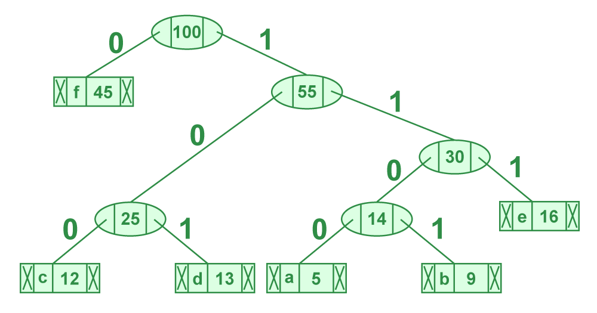

# 4. Huffman (Lossless)


## 📘 What is Huffman Coding?
Huffman coding is a variable-length, prefix-free coding algorithm used for lossless data compression. It reduces coding redundancy by assigning shorter codes to more frequent symbols.

---

## 🧮 Huffman Tree Construction Steps:
1. Count frequency of each symbol.
2. Create leaf nodes and insert into a priority queue.
3. While more than one node in the queue:
   - Remove two nodes with lowest frequency.
   - Combine them into a new node with frequency equal to sum.
   - Insert the new node into the queue.
4. Generate codes by traversing the tree.

---

## 🐍 Python Code Example
```python
import heapq  # For using the priority queue (min-heap)
from collections import defaultdict, Counter  # For handling frequency counting and dictionary

# Node class to represent each character and its frequency in the Huffman tree
class Node:
    def __init__(self, char, freq):
        self.char = char  # Character associated with this node (None for internal nodes)
        self.freq = freq  # Frequency of the character (or sum of frequencies for internal nodes)
        self.left = None  # Left child of the node
        self.right = None  # Right child of the node

    # This function allows the nodes to be compared based on frequency for the heap
    def __lt__(self, other):
        return self.freq < other.freq

# Function to build the Huffman tree from the frequency dictionary
def build_huffman_tree(freq_dict):
    # Create a list of Node objects for each character and its frequency
    heap = [Node(char, freq) for char, freq in freq_dict.items()]
    heapq.heapify(heap)  # Transform the list into a min-heap for efficient node merging

    # Combine the two nodes with the lowest frequencies until only one node remains
    while len(heap) > 1:
        node1 = heapq.heappop(heap)  # Pop the node with the lowest frequency
        node2 = heapq.heappop(heap)  # Pop the next node with the lowest frequency

        # Create a new internal node with no character and the sum of the two frequencies
        merged = Node(None, node1.freq + node2.freq)
        merged.left = node1  # Set the left child to node1
        merged.right = node2  # Set the right child to node2

        heapq.heappush(heap, merged)  # Push the merged node back into the heap

    # The last remaining node is the root of the Huffman tree
    return heap[0]

# Function to generate Huffman codes from the Huffman tree
def generate_codes(node, prefix='', codebook={}):
    # Recursively traverse the tree and generate the Huffman codes
    if node is not None:
        if node.char is not None:  # If the node is a leaf node (has a character)
            codebook[node.char] = prefix  # Assign the current prefix as the Huffman code for this character
        
        # Traverse the left subtree, appending '0' to the prefix
        generate_codes(node.left, prefix + '0', codebook)
        
        # Traverse the right subtree, appending '1' to the prefix
        generate_codes(node.right, prefix + '1', codebook)

    return codebook  # Return the codebook containing the Huffman codes for each character

# Input data (string to be encoded)
data = 'AABBCDEEEE'

# Count the frequency of each character in the data
freqs = Counter(data)

# Build the Huffman tree based on the character frequencies
tree = build_huffman_tree(freqs)

# Generate the Huffman codes from the tree
codes = generate_codes(tree)

# Print the resulting Huffman codes
print(codes)

```

---

## 🧠 MATLAB Code (conceptual logic)
```matlab
% Define symbols and probabilities
symbols = {'A','B','C','D','E'};
prob = [0.2, 0.2, 0.1, 0.1, 0.4];

% Generate the Huffman dictionary
[dict, avglen] = huffmandict(symbols, prob);

% Message to encode
sig = {'A','E','E','C','B'};

% Encode the message using the Huffman dictionary
comp = huffmanenco(sig, dict);

% Decode the encoded message
dsig = huffmandeco(comp, dict);

% Display the decoded message
disp(dsig);

```

---
.png)

## 🖼️ Huffman Tree 


---
